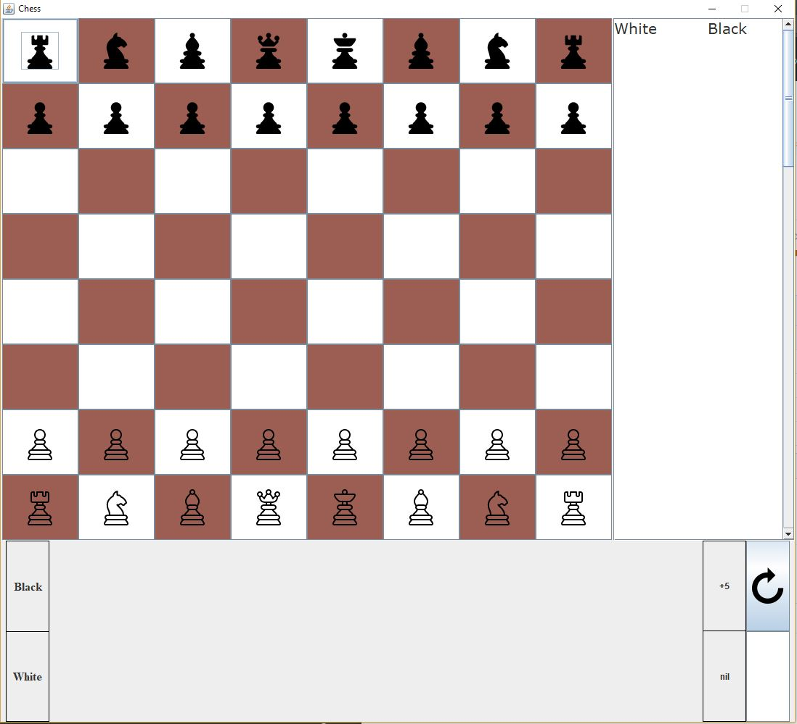

# Chess
This Java project was my final project for course CIS111B - Computer Science II: Object-Oriented Programming taken in Spring 2017.
There are still some featues missing such as pawn promotions, recognizing checkmate, horizontal pinning, discover check, and a move notation system.

## How to Run
1. Clone this repository.
2. Within the cloned folder, navigate to the file located at src/main/ChessMain2.java.
3. Open ChessMain2.java and run.

## Features and Functions
Current features include: 
-chess board 
-display of taken pieces 
-button to flip the board

Current working game functions: 
-en passant 
-castling 
-piece selection allowance based on move legality 
-piece capture 
-pinned piece: diagonally and vertically

## Player vs. Player (Local)
  - The GUI consitsts of 4 main components.
  